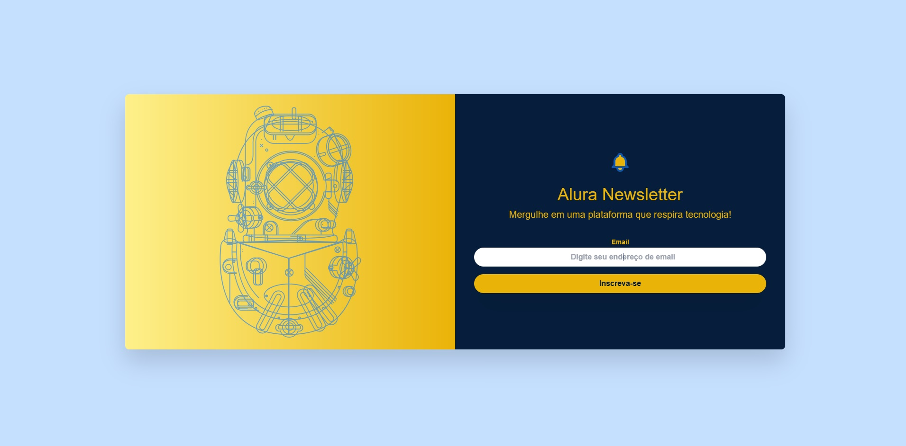

Projeto desenvolvido durante o curso Tailwind CSS: estilizando a sua página com classes utilitárias - Alura

Alura Newsletter - Página de Inscrição

Descrição:

Este projeto tem como objetivo criar uma página de inscrição para a newsletter da Alura, utilizando o framework CSS Tailwind CSS. A página possui um design clean e responsivo, com animações suaves e uma experiência de usuário intuitiva.

Tecnologias Utilizadas:

    HTML: Estrutura básica da página.
    CSS: Estilização da página, com o uso extensivo do Tailwind CSS.
       
  
